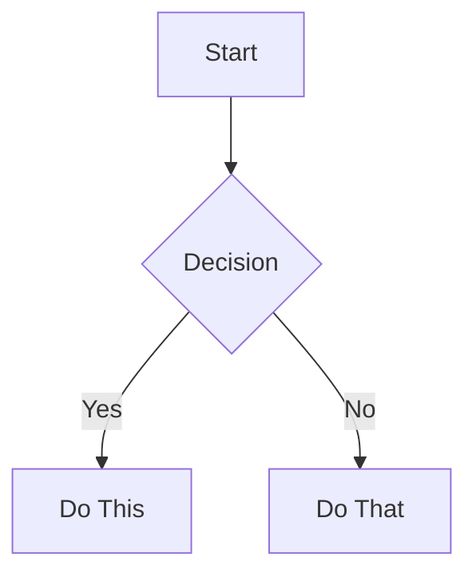

# Obsidian Markdown Quick Reference

## Frontmatter

```yaml
---
title: Note Title
date: 2025-01-13
author: Author Name
type: note
category: category
tags:
  - tag1
  - tag2
  - nested/tag3
aliases:
  - Alternative Name
cssclasses:
  - custom-class
status: completed
priority: high
related: "[[Other Note]]"
---
```

## Headings

```markdown
# Heading 1
## Heading 2
### Heading 3
#### Heading 4
##### Heading 5
###### Heading 6
```

## Text Formatting

| Style | Syntax | Output |
|-------|--------|--------|
| Bold | `**text**` or `__text__` | **Bold** |
| Italic | `*text*` or `_text_` | *Italic* |
| Bold + Italic | `***text***` | ***Both*** |
| Strikethrough | `~~text~~` | ~~Striked~~ |
| Highlight | `==text==` | ==Highlighted== |
| Code | `` `code` `` | `code` |

## Links

### Wikilinks

```markdown
[[Note Name]]
[[Note Name|Display Text]]
[[Note Name#Heading]]
[[Note Name#Heading|Custom Text]]
[[Note Name#^block-id]]
[[#Heading in same note]]
```

### Markdown Links

```markdown
[Display Text](Note%20Name.md)
[Display Text](Note%20Name.md#Heading)
[Display Text](https://example.com)
```

### Embeds

```markdown
![[Note Name]]
![[Note Name#Heading]]
![[Note Name#^block-id]]
![[image.png]]
![[image.png|640x480]]

```

## Callouts

```markdown
> [!note] Note
> Information

> [!info] Info
> Information

> [!tip] Tip
> Helpful hint

> [!success] Success
> Completed task

> [!question] Question
> FAQ item

> [!warning] Warning
> Important warning

> [!failure] Failure
> Error or failure

> [!danger] Danger
> Critical issue

> [!bug] Bug
> Bug report

> [!example] Example
> Example code

> [!quote] Quote
> Quotation

> [!todo] Todo
> Action item
```

### Foldable Callouts

```markdown
> [!faq]- Collapsed by default
> Hidden content

> [!faq]+ Expanded by default
> Visible but collapsible
```

## Lists

### Unordered

```markdown
- Item 1
- Item 2
  - Nested item
- Item 3
```

### Ordered

```markdown
1. First
2. Second
   1. Nested
   2. Another
3. Third
```

### Task

```markdown
- [ ] Incomplete
- [x] Completed
- [ ] With subtask
  - [ ] Subtask 1
  - [x] Subtask 2
```

## Tables

```markdown
| Header 1 | Header 2 | Header 3 |
|----------|----------|----------|
| Cell 1   | Cell 2   | Cell 3   |
| Cell 4   | Cell 5   | Cell 6   |
```

### Alignment

```markdown
| Left | Center | Right |
|:-----|:------:|------:|
| Left | Center | Right |
```

## Code

### Inline Code

```markdown
Use `backticks` for code
Use double `` `with backtick` `` backticks
```

### Code Blocks

````markdown
```
Plain code
```

```javascript
// Syntax highlighting
function hello() {
  console.log("Hello");
}
```
````

## Tags

```markdown
#tag
#nested/tag
#tag-with-dashes
#tag_with_underscores
```

In frontmatter:

```yaml
---
tags:
  - tag1
  - nested/tag2
  - tag3
---
```

## Block IDs

Link to specific paragraph:

```markdown
This is a paragraph. ^my-block-id

Link to it: [[Note#^my-block-id]]
```

For lists and quotes, add on separate line:

```markdown
> Quote line 1
> Quote line 2

^quote-id
```

## Math

Inline: `$E=mc^2$`

Block:

```markdown
$$
\begin{vmatrix}
a & b \\
c & d
\end{vmatrix} = ad - bc
$$
```

## Diagrams (Mermaid)

````markdown

````

## Comments

Hidden comments:

```markdown
Visible text %%but this is hidden%% text.

%%
Hidden comment block
Won't show in reading view
%%
```

## Horizontal Rules

```markdown
---
***
___
- - -
* * *
```

## HTML Content

```markdown
<div class="custom">Custom HTML</div>

<details>
  <summary>Click to expand</summary>
  Hidden content
</details>

<kbd>Ctrl</kbd> + <kbd>S</kbd>
```

## Footnotes

```markdown
Text with footnote[^1].

[^1]: Footnote content
```

## Escaping

Escape special characters with backslash:

```markdown
\*Not italic\*
\#Not heading\*
1\. Not a list
```
