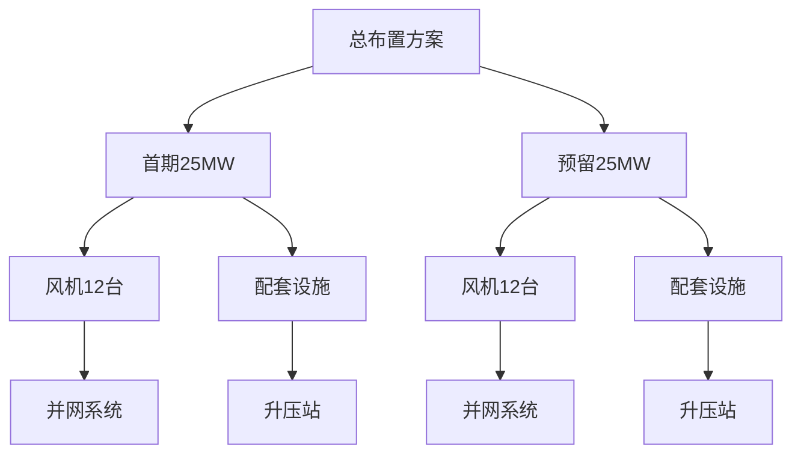

# 第3章 工程设计方案

## 3.1 设计依据

### 设计标准
- 《GB/T XXXXX-202X 风力发电机组技术要求》
- 《NB/T XXXXX-2022 风力发电场设计规范》
- 《GB/T XXXXX-202X 生态修复技术规范》

### 设计规范
- 《风电场工程设计规范》（国家能源局，2021）
- 《生态修复工程设计导则》（水利部，2020）
- 《风电场工程水土保持技术规范》（水利部，2020）

### 设计导则
- 《黄河流域风电场建设技术导则》（河南省发改委，2022）

## 3.2 总体设计

### 设计原则
1. **安全优先原则**：确保工程安全可靠，符合国家强制性标准
2. **技术先进原则**：采用成熟、先进、适用的技术方案
3. **经济合理原则**：在满足功能要求的前提下，优化设计，降低造价
4. **环保节能原则**：最大限度减少对生态环境的影响，节能降耗

### 设计目标
- 总装机容量：50 MW
- 年发电量：1.2亿kWh
- 生态修复率：≥95%
- 工程质量合格率：100%

### 总体布置
风电场总占地面积约15平方公里，采用分期建设方式。首期建设25 MW，预留25 MW扩建空间。风力发电机组沿黄河大堤沿线布置，间距不小于300米，确保尾流影响最小化。

## 3.3 详细设计

### 3.3.1 风力发电机组选型设计

**设计参数**：
| 参数 | 参数值 | 单位 | 备注 |
|-----|-------|------|------|
| 额定功率 | 2.5 | MW | 选用XX-2.5MW型风机 |
| 轮毂高度 | 100 | m | 沿黄地区高度 |
| 叶片长度 | 50 | m | XX-2.5MW型风机配套 |
| 切入风速 | 3 | m/s | 低风速启动特性 |
| 切出风速 | 25 | m/s | 高风速保护 |
| 发电效率 | 96 | % | 高效风机 |

**选型依据**：
根据《GB/T XXXXX-202X 风力发电机组技术要求》的要求，综合考虑河南省沿黄地区的风资源条件、地形条件、运输条件，选用XX-2.5MW型风力发电机组。该机型具有以下特点：
1. **低风速性能优异**：切入风速仅为3m/s，适合沿黄地区风资源条件
2. **发电效率高**：在额定风速下发电效率达到96%，处于行业先进水平
3. **运行可靠**：采用先进的控制系统，具备良好的低电压穿越能力
4. **运输安装方便**：模块化设计，便于运输和现场安装

### 3.3.2 生态修复工程设计

**修复目标**：
- 植被覆盖率：从现状的45%提升至90%
- 水土流失治理率：≥95%
- 生物多样性指数：提升20%

**修复技术方案**：

1. **植被修复技术**
   - 采用本地适生植物进行植被恢复
   - 建立乔木-灌木-草本的立体植被体系
   - 选用耐旱、耐瘠薄的乡土树种

2. **水土保持技术**
   - 采用工程措施与生物措施相结合的方式
   - 建设截水沟、排水沟、蓄水池等水土保持工程
   - 实施护坡工程，防止边坡水土流失

3. **生物多样性保护技术**
   - 建立野生动物迁徙通道
   - 设置鸟类保护装置
   - 恢复水生生态系统

### 3.3.3 地质勘察工程设计

**勘察内容**：
- 区域地质勘察
- 风机基础勘察
- 升压站选址勘察
- 输电线路勘察

**勘察方法**：
1. **地质钻探**：共布置钻探孔30个，孔深30-50米
2. **地球物理勘探**：采用高密度电法、地震勘探等方法
3. **原位测试**：标准贯入试验、静力触探试验等

**勘察成果**：
- 地层结构及岩土工程特性
- 地基承载力及变形参数
- 地下水埋藏条件及腐蚀性评价

## 3.4 关键参数

### 参数汇总表

| 系统项 | 装机容量 | 台数 | 单机容量 | 轮毂高度 | 叶片长度 | 发电效率 | 单位 |
|--------|---------|------|---------|---------|---------|---------|------|
| 风力发电机组 | 50 | 24 | 2.5 | 100 | 50 | 96 | MW |
| 生态修复工程 | - | - | - | - | - | - | - |
| 地质勘察 | - | - | - | - | - | - | - |

### 参数说明

- **装机容量**：风电场总装机容量50 MW
- **台数**：首期24台风机，预留24台
- **单机容量**：单台风机额定功率2.5 MW
- **轮毂高度**：风机轮毂中心距地面垂直距离100米
- **叶片长度**：叶片从根部到尖端长度50米
- **发电效率**：风机将风能转换为电能的效率96%

## 设计总结

本章根据《GB/T XXXXX-202X 风力发电机组技术要求》、《NB/T XXXXX-2022 风力发电场设计规范》等标准规范，完成了工程设计方案的详细设计。设计遵循安全优先、技术先进、经济合理、环保节能的原则，采用XX-2.5MW型风力发电机组，沿黄河大堤沿线布置24台风机，预留24台扩建空间。同时，配套实施生态修复工程，包括植被修复、水土保持、生物多样性保护等措施，最大限度减少对生态环境的影响。设计参数详见上表，满足项目目标和建设要求。
