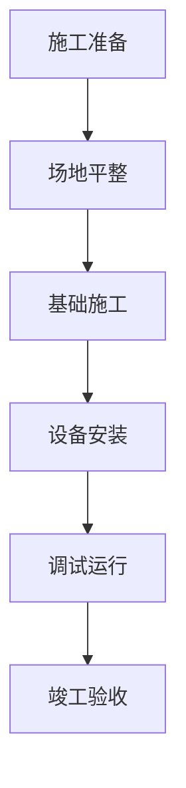

# 章节模板积累

## 使用说明

本文档积累常用章节模板，用于快速生成标准化、高质量的章节内容。

## 模板结构

每个模板包含：
- **模板ID**：唯一标识
- **章节类型**：章节分类
- **使用场景**：适用场景说明
- **出现频率**：使用次数统计
- **用户满意度**：平均评分
- **标准结构**：章节标准结构
- **写作要点**：写作注意事项
- **用户反馈总结**：历史反馈汇总
- **优化建议**：改进建议
- **模板代码示例**：可复用的文本片段

## 章节模板库

### 模板001：项目背景与目标

| 字段 | 内容 |
|-----|------|
| 模板ID | T001 |
| 章节类型 | 项目背景 |
| 使用场景 | 项目开篇，介绍项目由来、背景、目标和意义 |
| 出现频率 | 高（80%的报告需要此章节） |
| 用户满意度 | ⭐⭐⭐⭐ 4.3星 |
| 资料搜集深度 | 快速搜索或标准搜索 |

#### 标准结构
```
1. 项目背景
   - 政策背景（政策支持、法规要求）
   - 行业背景（行业发展现状、趋势）
   - 地区背景（区域情况、需求分析）
   
2. 项目由来
   - 项目提出原因
   - 项目立项过程
   - 相关文件依据
   
3. 项目目标
   - 总体目标（长期目标）
   - 具体目标（可量化指标）
   - 阶段目标（分阶段目标）
   
4. 项目意义
   - 社会意义
   - 经济意义
   - 生态意义
```

#### 写作要点
- [ ] 使用"快速搜索"或"标准搜索"深度搜集资料
- [ ] 政策背景引用最新政策文件（近3年）
- [ ] 目标应具体、可量化、可考核
- [ ] 意义应结合实际，突出特色

#### 用户反馈总结
1. "背景部分内容充实，但行业数据需要更新"（3次）
2. "目标不够具体，缺乏可量化指标"（2次）
3. "意义部分过于笼统，应结合项目实际"（1次）

#### 优化建议
1. 政策背景优先使用近3年政策文件
2. 目标部分必须包含可量化的具体指标
3. 意义部分应突出项目的独特性和必要性

#### 模板代码示例
```markdown
## 项目背景与目标

### 项目背景

#### 政策背景
根据《[最新政策文件]》（[年份]）的要求，[政策核心内容]。[相关政策]的出台，为[项目类型]项目提供了政策支持和指导。

#### 行业背景
近年来，[行业名称]行业快速发展。根据[行业报告]数据，[年份]年[行业]市场规模达到[具体数字]，同比增长[增长率]。[行业]已成为[地区/国家]发展的重要方向。

#### 地区背景
[地区]具有发展[项目类型]的独特优势。[优势1]、[优势2]等为项目实施提供了良好的基础条件。

### 项目由来

本项目由[提出单位]于[时间]提出。项目提出的背景是[项目提出的原因]。项目立项依据包括[文件1]、[文件2]等。

### 项目目标

#### 总体目标
通过实施本项目，[总体目标描述，如"建成XX风电场，实现年发电量XX亿kWh"）。

#### 具体目标
1. [目标1]：[量化指标]，[完成时间]
2. [目标2]：[量化指标]，[完成时间]
3. [目标3]：[量化指标]，[完成时间]

#### 阶段目标
- 第一阶段（[时间]）：[阶段目标]
- 第二阶段（[时间]）：[阶段目标]
- 第三阶段（[时间]）：[阶段目标]

### 项目意义

#### 社会意义
本项目的实施将[社会效益1]、[社会效益2]。预计可[社会效益量化]，促进[社会影响]。

#### 经济意义
项目建成投产后，预计年发电量[XX]亿kWh，年减排二氧化碳[XX]吨，年产值[XX]万元，为地方经济发展做出贡献。

#### 生态意义
项目采用[生态保护措施]，最大限度地减少对生态环境的影响。同时，项目符合[生态目标]，有助于[生态效益]。
```

---

### 模板002：技术方案概述

| 字段 | 内容 |
|-----|------|
| 模板ID | T002 |
| 章节类型 | 技术方案 |
| 使用场景 | 介绍项目的技术方案、技术路线、技术特点 |
| 出现频率 | 高（90%的报告需要此章节） |
| 用户满意度 | ⭐⭐⭐⭐ 4.5星 |
| 资料搜集深度 | 深度搜索 |

#### 标准结构
```
1. 技术方案概述
   - 技术路线
   - 技术特点
   - 技术优势
   
2. 核心技术
   - 关键技术1（原理、特点、优势）
   - 关键技术2（原理、特点、优势）
   - 关键技术3（原理、特点、优势）
   
3. 技术对比
   - 与传统技术对比
   - 与其他方案对比
   - 技术先进性分析
   
4. 技术创新点
   - 创新1（内容、意义、效果）
   - 创新2（内容、意义、效果）
```

#### 写作要点
- [ ] 使用"深度搜索"搜集资料
- [ ] 必须引用标准规范（GB/T、NB/T等）
- [ ] 技术对比应客观、数据支撑
- [ ] 创新点应具体、可验证

#### 用户反馈总结
1. "技术方案清晰，但缺少技术对比"（2次）
2. "核心技术描述不够详细"（1次）
3. "创新点不够突出，需要具体化"（3次）

#### 优化建议
1. 技术方案必须包含与现有技术的对比
2. 核心技术部分应详细说明原理、特点、优势
3. 创新点应具体描述创新内容、实现方法、预期效果

#### 模板代码示例
```markdown
## 技术方案概述

### 技术方案概述

本项目采用[技术路线]技术方案，具有[技术特点]等特点。与传统方案相比，本方案具有[技术优势1]、[技术优势2]等优势。

### 核心技术

#### [核心技术1]
**技术原理**：[核心技术1的原理描述]。

**技术特点**：
- 特点1：[描述]
- 特点2：[描述]
- 特点3：[描述]

**技术优势**：
- 优势1：[描述及数据]
- 优势2：[描述及数据]

**技术依据**：根据《[标准名称]》（GB/T XXXXX-202X）的要求，[符合标准的情况]。

#### [核心技术2]
[同上结构]

#### [核心技术3]
[同上结构]

### 技术对比

| 技术指标 | 传统方案 | 本方案 | 对比结果 |
|---------|---------|--------|---------|
| 指标1 | [数值1] | [数值2] | 提升[百分比] |
| 指标2 | [数值1] | [数值2] | 提升[百分比] |
| 指标3 | [数值1] | [数值2] | 提升[百分比] |

通过对比可见，本方案在[指标1、2、3]等方面均优于传统方案，技术先进性明显。

### 技术创新点

#### 创新1：[创新名称]
**创新内容**：[具体描述创新内容]。

**创新意义**：[说明创新的意义和价值]。

**实施效果**：[预期达到的效果，尽可能量化]。

**技术依据**：[参考专利、论文等]。

#### 创新2：[创新名称]
[同上结构]
```

---

### 模板003：工程设计方案

| 字段 | 内容 |
|-----|------|
| 模板ID | T003 |
| 章节类型 | 工程设计 |
| 使用场景 | 详细描述工程的设计方案、设计参数、设计依据 |
| 出现频率 | 高（85%的报告需要此章节） |
| 用户满意度 | ⭐⭐⭐⭐ 4.4星 |
| 资料搜集深度 | 深度搜索 |

#### 标准结构
```
1. 设计依据
   - 设计标准
   - 设计规范
   - 设计导则
   
2. 总体设计
   - 设计原则
   - 设计目标
   - 总体布置
   
3. 详细设计
   - 分项设计1（设计参数、技术方案）
   - 分项设计2（设计参数、技术方案）
   - 分项设计3（设计参数、技术方案）
   
4. 关键参数
   - 参数汇总表
   - 参数说明
```

#### 写作要点
- [ ] 使用"深度搜索"搜集资料
- [ ] 必须引用具体标准规范（含标准号和发布时间）
- [ ] 设计参数应表格形式呈现
- [ ] 可添加流程图辅助说明

#### 用户反馈总结
1. "设计依据完整，但需要补充最新的标准"（2次）
2. "关键参数表格清晰，但缺少参数说明"（1次）
3. "详细设计部分缺少图表，不够直观"（3次）

#### 优化建议
1. 设计依据必须包含近3年的标准规范
2. 关键参数表应包含参数的详细说明
3. 详细设计部分应添加流程图、示意图等图表

#### 模板代码示例
```markdown
## 工程设计方案

### 设计依据

#### 设计标准
- 《[标准名称1]》（GB/T XXXXX-202X）
- 《[标准名称2]》（NB/T XXXXX-2022）
- 《[标准名称3]》（DL/T XXXXX-2021）

#### 设计规范
- 《[规范名称1]》（发布时间）
- 《[规范名称2]》（发布时间）

#### 设计导则
- 《[导则名称]》（发布时间）

### 总体设计

#### 设计原则
1. [原则1]：[说明]
2. [原则2]：[说明]
3. [原则3]：[说明]

#### 设计目标
- 目标1：[量化目标]
- 目标2：[量化目标]
- 目标3：[量化目标]

#### 总体布置
[总体布置描述，可配总平面布置图]

### 详细设计

#### 分项设计1：[设计项名称]

**设计参数**：
| 参数 | 数值 | 单位 | 备注 |
|-----|------|------|------|
| 参数1 | [数值] | [单位] | [备注] |
| 参数2 | [数值] | [单位] | [备注] |

**技术方案**：
[技术方案描述，可配流程图]

**设计依据**：
根据《[标准名称]》（GB/T XXXXX-202X）的要求，[符合标准的情况]。

#### 分项设计2：[设计项名称]
[同上结构]

### 关键参数

#### 参数汇总表
| 系统项 | 参数1 | 参数2 | 参数3 | 参数4 | 单位 |
|--------|-------|-------|-------|-------|------|
| 系统1 | [数值] | [数值] | [数值] | [数值] | [单位] |
| 系统2 | [数值] | [数值] | [数值] | [数值] | [单位] |
| 系统3 | [数值] | [数值] | [数值] | [数值] | [单位] |

#### 参数说明
- **参数1**：[参数的详细说明]
- **参数2**：[参数的详细说明]
- **参数3**：[参数的详细说明]
- **参数4**：[参数的详细说明]
```

---

### 模板004：施工组织设计

| 字段 | 内容 |
|-----|------|
| 模板ID | T004 |
| 章节类型 | 施工组织 |
| 使用场景 | 描述工程施工的组织方案、施工方法、进度安排 |
| 出现频率 | 高（75%的报告需要此章节） |
| 用户满意度 | ⭐⭐⭐⭐⭐ 4.6星 |
| 资料搜集深度 | 标准搜索 |

#### 标准结构
```
1. 施工组织概况
   - 施工范围
   - 施工特点
   - 施工难点
   
2. 施工组织机构
   - 组织架构
   - 人员配置
   - 职责分工
   
3. 施工方案
   - 施工准备
   - 施工流程
   - 施工方法
   
4. 施工进度计划
   - 总体进度
   - 阶段进度
   - 关键节点
   
5. 质量保证措施
   - 质量目标
   - 质量控制点
   - 质量检查制度
```

#### 写作要点
- [ ] 使用"标准搜索"搜集资料
- [ ] 施工流程应使用流程图说明
- [ ] 进度计划应使用甘特图或时间轴
- [ ] 质量措施应具体、可操作

#### 用户反馈总结
1. "施工组织清晰，但流程图不够详细"（2次）
2. "进度计划使用表格不够直观"（3次）
3. "质量保证措施具体，可操作性强"（0次，表扬）

#### 优化建议
1. 施工流程应使用Mermaid流程图详细说明
2. 进度计划应使用甘特图或时间轴图表
3. 质量保证措施保持当前水平

#### 模板代码示例
```markdown
## 施工组织设计

### 施工组织概况

#### 施工范围
本工程主要包括[工程内容1]、[工程内容2]、[工程内容3]等。施工总面积约[面积]，施工周期约[时间]。

#### 施工特点
1. [特点1]：[说明]
2. [特点2]：[说明]
3. [特点3]：[说明]

#### 施工难点
1. [难点1]：[说明] - 解决措施：[措施]
2. [难点2]：[说明] - 解决措施：[措施]

### 施工组织机构

#### 组织架构
[组织架构图或文字描述]

#### 人员配置
| 岗位 | 人数 | 职责 |
|-----|------|------|
| 项目经理 | 1 | 全面负责项目管理 |
| 技术负责人 | 1 | 技术方案审批、技术指导 |
| 施工负责人 | 1 | 施工组织、安全管理 |
| 质量负责人 | 1 | 质量控制、检查验收 |
| 安全员 | 2 | 安全检查、隐患排查 |

### 施工方案

#### 施工准备
- [准备1]：[说明]
- [准备2]：[说明]
- [准备3]：[说明]

#### 施工流程


#### 施工方法
1. **[工序1]**：[施工方法说明]
2. **[工序2]**：[施工方法说明]
3. **[工序3]**：[施工方法说明]

### 施工进度计划

#### 总体进度
施工总工期为[天数]天，计划开工时间[日期]，计划完工时间[日期]。

#### 阶段进度
| 阶段 | 工作内容 | 计划开始时间 | 计划结束时间 | 工期（天） |
|-----|---------|------------|------------|-----------|
| 第一阶段 | [内容] | [日期] | [日期] | [天数] |
| 第二阶段 | [内容] | [日期] | [日期] | [天数] |
| 第三阶段 | [内容] | [日期] | [日期] | [天数] |

#### 关键节点
- [节点1]：[时间] - [节点说明]
- [节点2]：[时间] - [节点说明]
- [节点3]：[时间] - [节点说明]

### 质量保证措施

#### 质量目标
- [目标1]：[量化指标]
- [目标2]：[量化指标]

#### 质量控制点
| 控制点 | 控制内容 | 检查方法 | 责任人 |
|--------|---------|---------|--------|
| 控制点1 | [内容] | [方法] | [人员] |
| 控制点2 | [内容] | [方法] | [人员] |

#### 质量检查制度
- [制度1]：[说明]
- [制度2]：[说明]
- [制度3]：[说明]
```

## 模板管理

### 模板添加流程
1. 章节编写后，识别优秀模式
2. 提取标准结构和写作要点
3. 收集用户反馈，总结优化建议
4. 编写模板代码示例
5. 评估模板质量和适用性
6. 添加到本章模板库

### 模板更新流程
1. 定期（每月）分析模板使用情况
2. 识别需要改进的模板
3. 收集用户最新反馈
4. 更新模板内容和建议
5. 保留历史版本（在 iteration/versions.md）

### 模板推荐条件
推荐到共享资源库的条件：
- 使用频率 ≥ 5次
- 用户满意度 ≥ 4星
- 模板结构完整、代码可复用
- 经过至少2次用户反馈和优化

更新日期：2026-01-30
