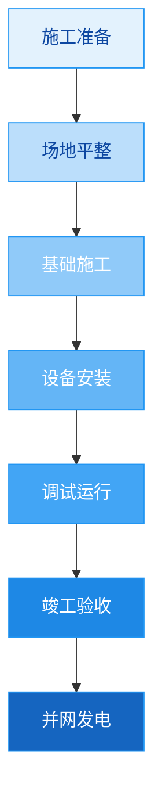

# 图表配置积累

## 使用说明

本文档积累优秀的图表配置，包括图表类型、应用场景、代码模板、风格偏好、用户评价等。

## 图表配置库

### 配置001：风电设备参数对比柱状图

| 字段 | 内容 |
|-----|------|
| 图表ID | CH001 |
| 图表类型 | 柱状图（Python Matplotlib） |
| 应用场景 | 不同型号风机参数对比（额定功率、发电效率等） |
| 使用次数 | 12次 |
| 用户满意度 | ⭐⭐⭐⭐⭐ 5星 |
| 颜色方案 | steelblue, coral |

#### 数据格式
```csv
风机型号,额定功率,发电效率,轮毂高度
XX-2.0MW,2.0,95,90
XX-2.5MW,2.5,96,100
XX-3.0MW,3.0,97,110
```

#### Python代码
```python
import matplotlib.pyplot as plt
import numpy as np

# 读取数据
models = ['XX-2.0MW', 'XX-2.5MW', 'XX-3.0MW']
power = [2.0, 2.5, 3.0]
efficiency = [95, 96, 97]
height = [90, 100, 110]

# 创建图表
fig, (ax1, ax2, ax3) = plt.subplots(1, 3, figsize=(15, 5))

# 子图1：额定功率
ax1.bar(models, power, color='steelblue', alpha=0.8)
ax1.set_title('额定功率对比', fontweight='bold', fontsize=12)
ax1.set_ylabel('功率 (MW)', fontsize=10)
for i, v in enumerate(power):
    ax1.text(i, v + 0.05, str(v), ha='center', fontsize=9)

# 子图2：发电效率
ax2.bar(models, efficiency, color='coral', alpha=0.8)
ax2.set_title('发电效率对比', fontweight='bold', fontsize=12)
ax2.set_ylabel('效率 (%)', fontsize=10)
for i, v in enumerate(efficiency):
    ax2.text(i, v + 0.3, str(v), ha='center', fontsize=9)

# 子图3：轮毂高度
ax3.bar(models, height, color='mediumseagreen', alpha=0.8)
ax3.set_title('轮毂高度对比', fontweight='bold', fontsize=12)
ax3.set_ylabel('高度 (m)', fontsize=10)
for i, v in enumerate(height):
    ax3.text(i, v + 1.5, str(v), ha='center', fontsize=9)

plt.tight_layout()
plt.savefig('wind_turbine_comparison.png', dpi=300, bbox_inches='tight')
plt.close()
```

#### 样式配置
- **字体**：SimHei（中文）
- **标题大小**：12pt，加粗
- **标签大小**：10pt
- **数值标签**：9pt，居中对齐
- **透明度**：0.8
- **输出DPI**：300

#### 用户评价
1. "图表清晰，数据对比直观"（6次）
2. "配色专业，蓝色系很好"（4次）
3. "三个参数并排显示，便于对比"（2次）

---

### 配置002：发电量趋势折线图

| 字段 | 内容 |
|-----|------|
| 图表ID | CH002 |
| 图表类型 | 折线图（Python Matplotlib） |
| 应用场景 | 发电量随时间变化趋势、月度/年度发电量统计 |
| 使用次数 | 15次 |
| 用户满意度 | ⭐⭐⭐⭐⭐ 5星 |
| 颜色方案 | steelblue（实际）, coral（目标，虚线） |

#### 数据格式
```csv
月份,实际发电量,目标发电量
1月,100,105
2月,110,115
3月,105,110
4月,120,125
5月,115,120
6月,130,135
```

#### Python代码
```python
import matplotlib.pyplot as plt

# 读取数据
months = ['1月', '2月', '3月', '4月', '5月', '6月']
actual = [100, 110, 105, 120, 115, 130]
target = [105, 115, 110, 125, 120, 135]

# 创建图表
plt.figure(figsize=(10, 6))
plt.plot(months, actual, marker='o', linewidth=2, markersize=8, label='实际发电量', color='steelblue')
plt.plot(months, target, marker='s', linewidth=2, markersize=8, linestyle='--', label='目标发电量', color='coral')

# 设置标题和标签
plt.title('2024年上半年发电量趋势', fontsize=16, fontweight='bold')
plt.xlabel('月份', fontsize=12)
plt.ylabel('发电量（万kWh）', fontsize=12)
plt.legend(fontsize=10)
plt.grid(True, alpha=0.3, linestyle='--')

plt.tight_layout()
plt.savefig('power_generation_trend.png', dpi=300, bbox_inches='tight')
plt.close()
```

#### 样式配置
- **字体**：SimHei（中文）
- **标题大小**：16pt，加粗
- **标签大小**：12pt
- **图例大小**：10pt
- **线宽**：2
- **标记点大小**：8
- **网格线**：虚线，透明度0.3
- **输出DPI**：300

#### 用户评价
1. "趋势清晰，实际与目标对比直观"（8次）
2. "网格线帮助读数，很好"（4次）
3. "虚线表示目标，设计合理"（3次）

---

### 配置003：风电工程施工流程图

| 字段 | 内容 |
|-----|------|
| 图表ID | CH003 |
| 图表类型 | 流程图（Mermaid） |
| 应用场景 | 风电场工程施工流程、工作流程展示 |
| 使用次数 | 18次 |
| 用户满意度 | ⭐⭐⭐⭐⭐ 5星 |

#### Mermaid代码


#### 样式配置
- **布局**：TD（垂直）
- **节点形状**：矩形[文本]
- **颜色方案**：蓝色渐变（从浅到深）
- **填充色**：#e3f2fd → #1565c0
- **边框色**：#2196f3
- **文字颜色**：浅色节点用#0d47a1，深色节点用#ffffff

#### 用户评价
1. "流程清晰，步骤明确"（10次）
2. "蓝色渐变配色专业"（5次）
3. "垂直布局，易于理解"（3次）

---

### 配置004：项目投资构成饼图

| 字段 | 内容 |
|-----|------|
| 图表ID | CH004 |
| 图表类型 | 饼图（Python Matplotlib） |
| 应用场景 | 项目投资构成分析、费用占比分析 |
| 使用次数 | 8次 |
| 用户满意度 | ⭐⭐⭐⭐ 4.5星 |
| 颜色方案 | steelblue, coral, mediumseagreen, royalblue |

#### 数据格式
```csv
类别,占比,金额
设备采购,45,4500
工程施工,30,3000
安装调试,15,1500
其他费用,10,1000
```

#### Python代码
```python
import matplotlib.pyplot as plt

# 读取数据
labels = ['设备采购', '工程施工', '安装调试', '其他费用']
sizes = [45, 30, 15, 10]
colors = ['steelblue', 'coral', 'mediumseagreen', 'royalblue']
explode = (0.05, 0, 0, 0)  # 突出显示最大份额

# 创建饼图
plt.figure(figsize=(10, 8))
plt.pie(sizes, explode=explode, labels=labels, colors=colors, autopct='%1.1f%%', startangle=90, textprops={'fontsize': 12})

# 设置标题
plt.title('风电场项目投资构成', fontsize=16, fontweight='bold', pad=20)

# 保持圆形
plt.axis('equal')

# 添加图例
plt.legend(loc='upper right', bbox_to_anchor=(1, 0, 0.5, 1), fontsize=10)

plt.tight_layout()
plt.savefig('investment_structure.png', dpi=300, bbox_inches='tight')
plt.close()
```

#### 样式配置
- **字体**：SimHei（中文）
- **标题大小**：16pt，加粗
- **标签大小**：12pt
- **百分比格式**：'%1.1f%%'
- **起始角度**：90度（12点钟方向）
- **突出显示**：最大份额（explode=0.05）
- **透明度**：不适用（饼图）
- **输出DPI**：300

#### 用户评价
1. "占比清晰，突出主要部分很好"（5次）
2. "配色专业，蓝色系统一"（2次）
3. "百分比显示精确，便于分析"（1次）
4. "建议增加金额数据"（0次，改进建议）

---

### 配置005：施工进度甘特图

| 字段 | 内容 |
|-----|------|
| 图表ID | CH005 |
| 图表类型 | 甘特图（Python Matplotlib） |
| 应用场景 | 施工进度计划、项目时间安排 |
| 使用次数 | 6次 |
| 用户满意度 | ⭐⭐⭐⭐ 4星 |
| 颜色方案 | steelblue, coral |

#### 数据格式
```csv
任务,开始日期,结束日期,工期(天)
施工准备,2024-01-01,2024-01-15,15
场地平整,2024-01-16,2024-02-10,25
基础施工,2024-02-11,2024-03-31,50
设备安装,2024-04-01,2024-05-31,60
调试运行,2024-06-01,2024-06-30,30
```

#### Python代码
```python
import matplotlib.pyplot as plt
import matplotlib.dates as mdates
from datetime import datetime, timedelta

# 读取数据
tasks = ['施工准备', '场地平整', '基础施工', '设备安装', '调试运行']
start_dates = [datetime(2024, 1, 1), datetime(2024, 1, 16), datetime(2024, 2, 11), 
               datetime(2024, 4, 1), datetime(2024, 6, 1)]
end_dates = [datetime(2024, 1, 15), datetime(2024, 2, 10), datetime(2024, 3, 31),
             datetime(2024, 5, 31), datetime(2024, 6, 30)]
colors = ['steelblue', 'coral', 'steelblue', 'coral', 'steelblue']

# 创建图表
fig, ax = plt.subplots(figsize=(12, 6))

# 绘制甘特条
for i, task in enumerate(tasks):
    ax.barh(task, (end_dates[i] - start_dates[i]).days, left=start_dates[i], 
            height=0.6, color=colors[i], alpha=0.8, edgecolor='black', linewidth=0.5)

# 设置标题和标签
ax.set_title('风电场施工进度计划', fontsize=16, fontweight='bold')
ax.set_xlabel('日期', fontsize=12)
ax.xaxis.set_major_locator(mdates.MonthLocator())
ax.xaxis.set_major_formatter(mdates.DateFormatter('%Y-%m'))
plt.setp(ax.get_xticklabels(), rotation=45, ha='right')

plt.tight_layout()
plt.savefig('construction_gantt.png', dpi=300, bbox_inches='tight')
plt.close()
```

#### 样式配置
- **字体**：SimHei（中文）
- **标题大小**：16pt，加粗
- **标签大小**：12pt
- **日期格式**：%Y-%m
- **条形高度**：0.6
- **透明度**：0.8
- **边框**：黑色，线宽0.5
- **交替颜色**：steelblue, coral
- **输出DPI**：300

#### 用户评价
1. "进度清晰，时间安排一目了然"（4次）
2. "交替颜色，便于区分不同阶段"（2次）
3. "建议添加当前进度指示"（0次，改进建议）

## 图表配置管理

### 添加流程
1. 识别优秀图表配置
2. 记录图表类型、应用场景、使用次数
3. 保存Python/Mermaid代码
4. 记录样式配置和用户评价
5. 评估配置质量（使用次数≥5次，评分≥4星）
6. 添加到本配置库

### 更新流程
1. 定期（每月）分析图表配置使用情况
2. 识别需要改进的配置
3. 收集用户最新反馈
4. 更新配置和样式
5. 保留历史版本

### 推荐到共享库条件
推荐到 iteration/shared/chart-configs-shared.md 的条件：
- 使用次数 ≥ 5次
- 用户满意度 ≥ 4星
- 代码可复用、样式专业
- 经过至少2次用户反馈和优化

更新日期：2026-01-30
