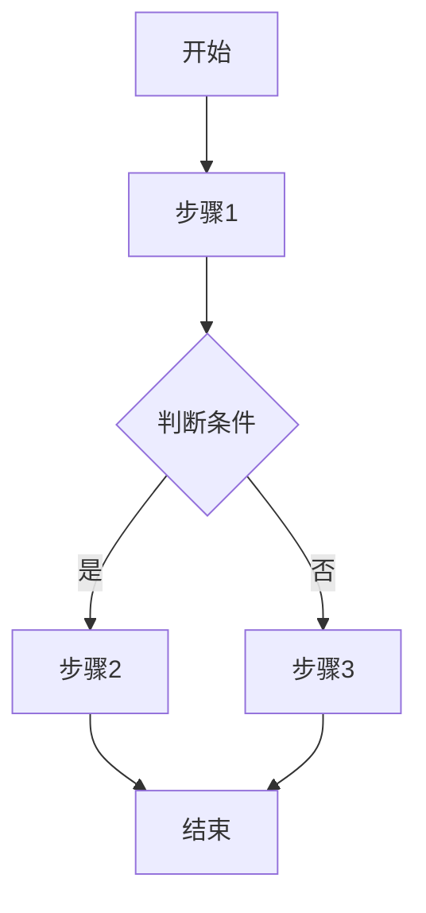
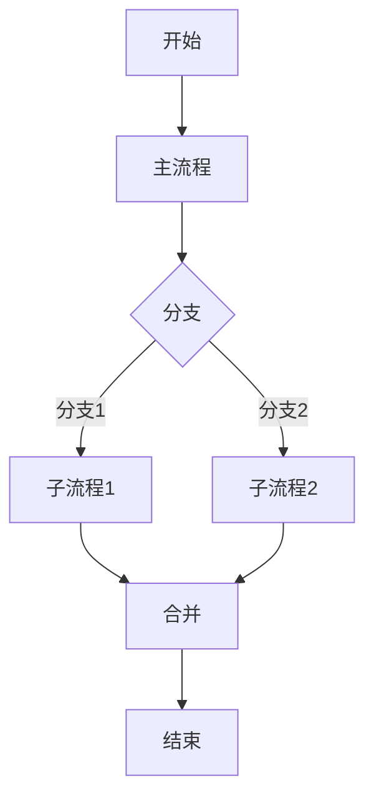
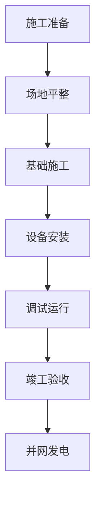

# 图表模式库

## 使用说明

本文档提供工程技术报告中常用图表的模式、模板和配置，支持自动生成多种类型的图表。

## 图表类型概览

| 图表类型 | 生成工具 | 适用场景 | 复杂度 | 推荐度 |
|---------|---------|---------|---------|--------|
| 流程图 | Mermaid | 工艺流程、工作流程、业务流程 | 中 | ⭐⭐⭐⭐⭐ |
| 柱状图 | Python Matplotlib | 数据对比、统计分析、数量对比 | 低 | ⭐⭐⭐⭐ |
| 折线图 | Python Matplotlib | 趋势分析、时间序列、变化规律 | 低 | ⭐⭐⭐⭐ |
| 饼图 | Python Matplotlib | 占比分析、构成分析、比例关系 | 低 | ⭐⭐⭐ |
| 表格 | Markdown | 数据展示、参数对比、规格说明 | 低 | ⭐⭐⭐⭐⭐ |

## 流程图（Mermaid）

### 使用场景
- 工艺流程图：风电工程施工流程
- 工作流程图：报告编写流程
- 业务流程图：项目管理流程
- 决策流程图：质量检查流程

### 基本模板

#### 1. 垂直流程图


#### 2. 水平流程图


#### 3. 复杂流程图（子流程）


### 实际案例：风电工程施工流程


### 样式配置
- **节点颜色**：使用默认蓝色系
- **箭头方向**：默认方向（TD/LR）
- **节点形状**：矩形[文本]
- **条件判断**：菱形{文本}

## 柱状图（Python Matplotlib）

### 使用场景
- 数据对比：不同方案的技术参数对比
- 统计分析：各阶段工作量统计
- 数量对比：设备数量、人员配置

### 基本模板

#### 1. 简单柱状图
```python
import matplotlib.pyplot as plt
import matplotlib.font_manager as fm

# 设置中文字体
plt.rcParams['font.sans-serif'] = ['SimHei', 'Arial Unicode MS']
plt.rcParams['axes.unicode_minus'] = False

# 数据
categories = ['类别1', '类别2', '类别3', '类别4']
values = [10, 20, 15, 25]

# 创建图表
plt.figure(figsize=(10, 6))
plt.bar(categories, values, color='steelblue', alpha=0.8)

# 设置标题和标签
plt.title('图表标题', fontsize=16, fontweight='bold')
plt.xlabel('X轴标签', fontsize=12)
plt.ylabel('Y轴标签', fontsize=12)

# 显示数值标签
for i, v in enumerate(values):
    plt.text(i, v + 0.5, str(v), ha='center', fontsize=10)

# 调整布局并保存
plt.tight_layout()
plt.savefig('chart.png', dpi=300, bbox_inches='tight')
plt.close()
```

#### 2. 分组柱状图
```python
import matplotlib.pyplot as plt
import numpy as np

# 数据
categories = ['组1', '组2', '组3', '组4']
group1 = [10, 15, 20, 18]
group2 = [12, 18, 22, 16]

x = np.arange(len(categories))
width = 0.35

# 创建图表
fig, ax = plt.subplots(figsize=(10, 6))
bars1 = ax.bar(x - width/2, group1, width, label='系列1', color='steelblue')
bars2 = ax.bar(x + width/2, group2, width, label='系列2', color='coral')

# 设置标题和标签
ax.set_title('分组柱状图标题', fontsize=16, fontweight='bold')
ax.set_xlabel('类别', fontsize=12)
ax.set_ylabel('数值', fontsize=12)
ax.set_xticks(x)
ax.set_xticklabels(categories)
ax.legend()

# 保存
plt.tight_layout()
plt.savefig('grouped_bar.png', dpi=300, bbox_inches='tight')
plt.close()
```

### 样式配置
- **颜色方案**：steelblue, coral, mediumseagreen, royalblue
- **字体大小**：标题16pt，标签12pt，数值10pt
- **透明度**：alpha=0.8
- **输出格式**：PNG, DPI=300

### 实际案例：风电设备配置对比
```python
categories = ['风机A', '风机B', '风机C']
power = [2.0, 2.5, 3.0]  # 额定功率（MW）
efficiency = [95, 96, 97]   # 发电效率（%）

fig, (ax1, ax2) = plt.subplots(1, 2, figsize=(12, 5))

ax1.bar(categories, power, color='steelblue')
ax1.set_title('额定功率对比', fontweight='bold')
ax1.set_ylabel('功率 (MW)')

ax2.bar(categories, efficiency, color='coral')
ax2.set_title('发电效率对比', fontweight='bold')
ax2.set_ylabel('效率 (%)')

plt.tight_layout()
plt.savefig('wind_turbine_comparison.png', dpi=300, bbox_inches='tight')
plt.close()
```

## 折线图（Python Matplotlib）

### 使用场景
- 趋势分析：风速、发电量随时间变化
- 时间序列：工程进度跟踪
- 变化规律：温度、降雨等环境因素

### 基本模板

#### 1. 简单折线图
```python
import matplotlib.pyplot as plt
import matplotlib.dates as mdates
from datetime import datetime

# 数据
dates = ['2024-01', '2024-02', '2024-03', '2024-04', '2024-05']
values = [10, 15, 20, 18, 25]

# 创建图表
plt.figure(figsize=(10, 6))
plt.plot(dates, values, marker='o', linewidth=2, markersize=8, color='steelblue')

# 设置标题和标签
plt.title('折线图标题', fontsize=16, fontweight='bold')
plt.xlabel('时间', fontsize=12)
plt.ylabel('数值', fontsize=12)

# 添加网格
plt.grid(True, alpha=0.3, linestyle='--')

# 保存
plt.tight_layout()
plt.savefig('line_chart.png', dpi=300, bbox_inches='tight')
plt.close()
```

#### 2. 多系列折线图
```python
import matplotlib.pyplot as plt

# 数据
months = ['1月', '2月', '3月', '4月', '5月', '6月']
series1 = [100, 110, 105, 120, 115, 130]
series2 = [90, 95, 100, 98, 105, 110]

# 创建图表
plt.figure(figsize=(10, 6))
plt.plot(months, series1, marker='o', linewidth=2, markersize=6, label='系列1', color='steelblue')
plt.plot(months, series2, marker='s', linewidth=2, markersize=6, label='系列2', color='coral')

# 设置标题和标签
plt.title('多系列折线图', fontsize=16, fontweight='bold')
plt.xlabel('时间', fontsize=12)
plt.ylabel('数值', fontsize=12)
plt.legend(fontsize=10)

plt.grid(True, alpha=0.3, linestyle='--')
plt.tight_layout()
plt.savefig('multi_line.png', dpi=300, bbox_inches='tight')
plt.close()
```

### 样式配置
- **线条样式**：实线，宽度2
- **标记点**：圆形(o)或方形(s)，大小6-8
- **颜色方案**：steelblue, coral, mediumseagreen
- **网格线**：浅色虚线，透明度0.3

### 实际案例：发电量趋势分析
```python
months = ['1月', '2月', '3月', '4月', '5月', '6月']
actual = [100, 110, 105, 120, 115, 130]  # 实际发电量
target = [105, 115, 110, 125, 120, 135]   # 目标发电量

plt.figure(figsize=(10, 6))
plt.plot(months, actual, marker='o', linewidth=2, label='实际发电量', color='steelblue')
plt.plot(months, target, marker='s', linewidth=2, linestyle='--', label='目标发电量', color='coral')

plt.title('2024年上半年发电量趋势', fontsize=16, fontweight='bold')
plt.xlabel('月份', fontsize=12)
plt.ylabel('发电量（万kWh）', fontsize=12)
plt.legend(fontsize=10)
plt.grid(True, alpha=0.3, linestyle='--')

plt.tight_layout()
plt.savefig('power_generation_trend.png', dpi=300, bbox_inches='tight')
plt.close()
```

## 饼图（Python Matplotlib）

### 使用场景
- 占比分析：投资构成分析
- 构成分析：工程量占比
- 比例关系：设备配置比例

### 基本模板

#### 1. 简单饼图
```python
import matplotlib.pyplot as plt

# 数据
labels = ['类别1', '类别2', '类别3', '类别4']
sizes = [30, 25, 20, 25]
colors = ['steelblue', 'coral', 'mediumseagreen', 'royalblue']

# 创建饼图
plt.figure(figsize=(8, 8))
plt.pie(sizes, labels=labels, colors=colors, autopct='%1.1f%%', startangle=90, explode=(0.05, 0, 0, 0))

# 设置标题
plt.title('饼图标题', fontsize=16, fontweight='bold')

# 保持圆形
plt.axis('equal')

# 保存
plt.tight_layout()
plt.savefig('pie_chart.png', dpi=300, bbox_inches='tight')
plt.close()
```

### 样式配置
- **颜色方案**：steelblue, coral, mediumseagreen, royalblue
- **百分比显示**：autopct='%1.1f%%'
- **起始角度**：90度（12点钟方向）
- **突出显示**：主要部分可设置explode

### 实际案例：投资构成分析
```python
labels = ['设备采购', '工程施工', '安装调试', '其他费用']
sizes = [45, 30, 15, 10]
colors = ['steelblue', 'coral', 'mediumseagreen', 'royalblue']

plt.figure(figsize=(10, 8))
plt.pie(sizes, labels=labels, colors=colors, autopct='%1.1f%%', startangle=90, explode=(0.05, 0, 0, 0), textprops={'fontsize': 12})

plt.title('风电场项目投资构成', fontsize=16, fontweight='bold')
plt.axis('equal')

plt.tight_layout()
plt.savefig('investment_structure.png', dpi=300, bbox_inches='tight')
plt.close()
```

## 表格（Markdown）

### 使用场景
- 参数对比：技术参数对比
- 数据展示：工程量清单
- 规格说明：设备规格表

### 基本模板

#### 1. 简单表格
```markdown
| 列1 | 列2 | 列3 |
|-----|-----|-----|
| 数据1 | 数据2 | 数据3 |
| 数据4 | 数据5 | 数据6 |
```

#### 2. 复杂表格（带合并）
```markdown
| 项目 | 参数1 | 参数2 | 参数3 |
|-----|-------|-------|-------|
| 类别A | 数据A1 | 数据A2 | 数据A3 |
| 类别B | 数据B1 | 数据B2 | 数据B3 |
| **合计** | **总计** | **平均** | **...** |
```

### 实际案例：风机技术参数表
```markdown
| 风机型号 | 额定功率 | 轮毂高度 | 叶片长度 | 切入风速 | 切出风速 |
|---------|---------|---------|---------|---------|---------|
| XX-2.0MW | 2.0 MW | 90 m | 45 m | 3 m/s | 25 m/s |
| XX-2.5MW | 2.5 MW | 100 m | 50 m | 3 m/s | 25 m/s |
| XX-3.0MW | 3.0 MW | 110 m | 55 m | 3 m/s | 25 m/s |
```

## 图表生成脚本使用

### 使用generate_chart.py脚本
```bash
# 生成柱状图
python3 scripts/generate_chart.py --type bar --data data.csv --output bar_chart.png

# 生成折线图
python3 scripts/generate_chart.py --type line --data data.csv --output line_chart.png

# 生成饼图
python3 scripts/generate_chart.py --type pie --data data.csv --output pie_chart.png

# 生成流程图
python3 scripts/generate_chart.py --type flowchart --input flowchart.mmd --output flowchart.png
```

## 图表样式规范

### 通用规范
- 所有图表必须有标题
- 坐标轴必须有标签
- 数值标签清晰可读
- 颜色使用专业配色
- 保持风格统一

### 标题格式
- 简洁明了，说明图表内容
- 字体大小16pt，加粗
- 位置居中或左对齐

### 坐标轴标签
- X轴说明类别或时间
- Y轴说明数值及其单位
- 字体大小12pt

### 图例说明
- 多系列图表必须有图例
- 图例位置不遮挡数据
- 字体大小10pt

## 图表配置存储

优秀图表配置应保存到 iteration/patterns/chart-configs.md，包括：
- 图表类型
- 应用场景
- 数据格式
- 样式配置
- 用户评价

更新日期：2026-01-30
